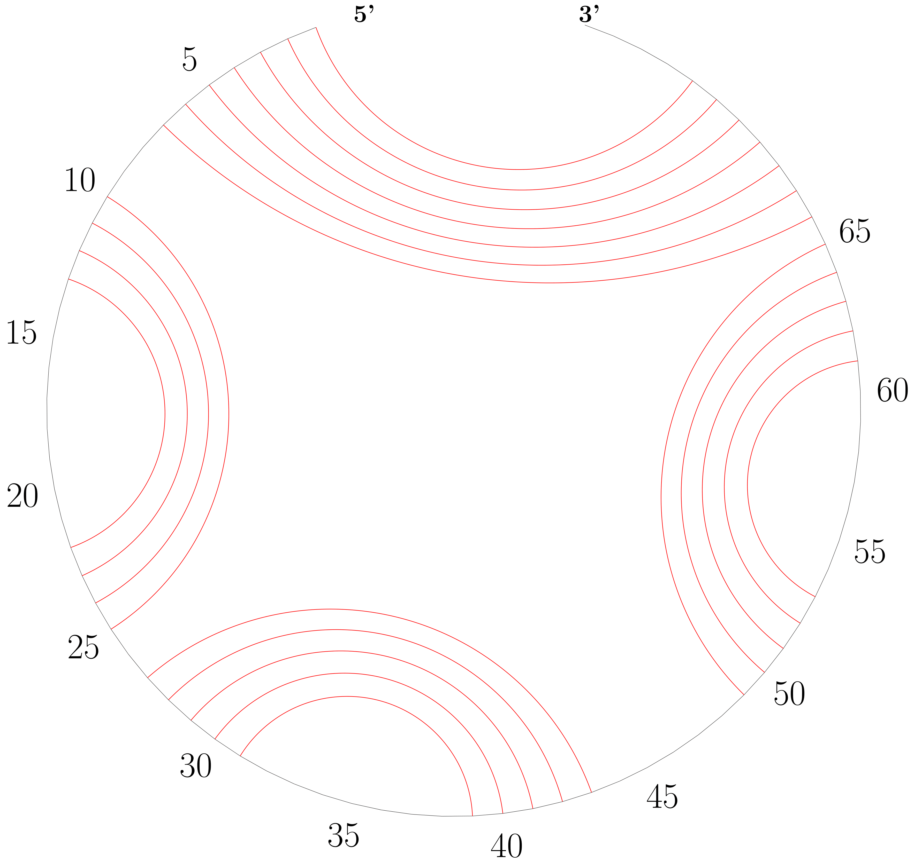

This codebase replaces the now deprecated version: https://github.com/abentu0101/LinearFold.
This version fixes many bugs and design problems in the old version.

# LinearFold: Linear-Time Prediction for RNA Secondary Structures

This repository contains the C++ source code for the LinearFold project, the first linear-time prediction algorithm/software for RNA secondary structures.

[LinearFold: Linear-Time Approximate RNA Folding by 5’-to-3’ Dynamic Programming and Beam Search](https://academic.oup.com/bioinformatics/article/35/14/i295/5529205). Bioinformatics, Volume 35, Issue 14, July 2019, Pages i295–i304. ISMB 2019

Liang Huang*, He Zhang**, Dezhong Deng**, Kai Zhao, Kaibo Liu, David Hendrix, David Mathews

\* corresponding author

** contributed equally

Web server: http://linearfold.org


## Dependencies
GCC 4.8.5 or above; 
python3

## To Compile
```
make
```

## To Run
The LinearFold parser can be run with:
```
echo SEQUENCE | ./linearfold [OPTIONS]

OR

cat SEQ_OR_FASTA_FILE | ./linearfold [OPTIONS]
```
Both FASTA format and pure-sequence format are supported for input.

OPTIONS:
```
--beamsize BEAM_SIZE or -b BEAM_SIZE 
```
The beam size (default 100). Use 0 for infinite beam.
```
--Vienna or -V
```
Switches LinearFold-C (by default) to LinearFold-V.
```
--fasta
```
Specify that the input is in fasta format. (default FALSE)
```
--verbose or -v
```
Prints out energy of each loop in the structure. (default False)
```
--sharpturn
```
Enable sharpturn in prediction. (default False)
```
--eval
```
Enable eval mode, which can calculate free energy for a given structure of a sequence. (default False)
```
--constraints
```
Enable adding specific constraints in prediction (default False). 
The constraint sequence should have the same length as the RNA sequence. 
"? . ( )" indicates a position for which the proper matching is unknown, unpaired, left or right parenthesis respectively. The parentheses must be well-banlanced and non-crossing.

```
--zuker
```
output Zuker suboptimal structures, (DEFAULT=FALSE)

```
--delta
```
compute Zuker suboptimal structures with scores or energies(-V, kcal/mol) in a centain range of the optimum, (DEFAULT=5.0)


```
--shape <filename>
```
use SHAPE reactivity data to guide structure predictions  
Please refer to this link for the SHAPE data format:
https://rna.urmc.rochester.edu/Text/File_Formats.html#SHAPE

```
--dangles INT or -d INT
```
the way to treat "dangling end" energies for bases adjacent to helices in free ends and multi-loops, (only supporting 0 or 2, DEFAULT=2)  
--dangles 0, ignores dangling ends  
--dangles 2, dangling energies are added for the bases adjacent to a helix on both sides in any case


## To Visualize 
LinearFold is able to visualize the structure using a circular plot.

To draw a circular plot, run command:  
```
cat TARGET_FILE | ./draw_circular_plot 
```
TARGET_FILE contains one sequence and its structure; see "ecoli_tRNA" file as an example.


## Example Run Predict
```
cat testseq | ./linearfold
UGAGUUCUCGAUCUCUAAAAUCG
....................... (-0.22)
AAAACGGUCCUUAUCAGGACCAAACA
.....((((((....))))))..... (4.91)
AUUCUUGCUUCAACAGUGUUUGAACGGAAU
.............................. (-0.29)
UCGGCCACAAACACACAAUCUACUGUUGGUCGA
(((((((...................))))))) (0.99)
GUUUUUAUCUUACACACGCUUGUGUAAGAUAGUUA
.....(((((((((((....))))))))))).... (6.66)

echo GGGCUCGUAGAUCAGCGGUAGAUCGCUUCCUUCGCAAGGAAGCCCUGGGUUCAAAUCCCAGCGAGUCCACCA | ./linearfold -V -b 20
GGGCUCGUAGAUCAGCGGUAGAUCGCUUCCUUCGCAAGGAAGCCCUGGGUUCAAAUCCCAGCGAGUCCACCA
(((((((..((((.......))))((((((((...)))))))).(((((.......)))))))))))).... (-31.50)
```

## Example Run Predict with constraints
```
cat testcons | ./linearfold --constraints
AACUCCGCCAGGCCUGGAAGGGAGCAACGGUAGUGACACUCUCUGUGUGCGUAGGUUGCCUAGCUACCAUUU
??(???(??????)?(????????)???(??????(???????)?)???????????)??.???????????
..(.(((......)((........))(((......(.......).))).....))..).............. (-27.33)
GCCUGGUGACCAUAGCGAGUCGGUACCACCCCUUCCCAUCCCGAACAGGACCGUGAAACGACUCCGCGCCGAUGAUAGUGCGGAUUCCCGUGUGAAAGUAGGUCAUCGCCAGGC
??(??(???(??????)???????????????(????)???(???????????(??(????.)??????????(??????)?)??????)????????????)????????)??
(((((((..(......).........(((...(....)...((....(((...(..(.....)..........(......).)..))))).))).......))))......))) (-44.00)

echo -e "GAACCCCGUCAGGUCCGGAAGGAAGCAGCGGUAAGU\n??????????????????(????????????????)" | ./linearfold --constraints
GAACCCCGUCAGGUCCGGAAGGAAGCAGCGGUAAGU
??????????????????(????????????????)
..................(................) (-8.85)

echo -e "GAACCCCGUCAGGUCCGGAAGGAAGCAGCGGUAAGU\n??????????????????(????????????????)" | ./linearfold --constraints -V
GAACCCCGUCAGGUCCGGAAGGAAGCAGCGGUAAGU
??????????????????(????????????????)
.....(((.......)))(.....((....))...) (3.70)
```

## Example Run Predict and output suboptimal structures
```
echo GCCUGGUGACCAUAGCGAGUCGGUACCACCCCUUCCCAUCCCGAACAGGACCGUGAAACGACUCCGCGCCGAUGAUAGUGCGGAUUCCCGUGUGAAAGUAGGUCAUCGCCAGGC | ./linearfold -V --zuker --delta 2.0
(((((((((.....((((((((....(((.(((((.......))..)))...)))...)))))).))(((.........((((....)))).........)))..))))))))) (-35.50)
Zuker suboptimal structures...
(((((((((.....((((((((....(((.(((((.......))..)))...)))...)))))).))(((.........((((....)))).........)))..))))))))) (-35.50)
(((((((((.....((((((((....(((.(((((.......))..)))...)))...)))))).))(((.((......((((....))))......)).)))..))))))))) (-35.40)
(((((((((.....((((((((....(((....(((...........)))..)))...)))))).))(((.........((((....)))).........)))..))))))))) (-34.90)
(((((((((.....((((((((....(((.(((((.......))..)))...)))...)))))).))(((.((..(..(((((....)))))..)..)).)))..))))))))) (-34.70)
(((((((((((.....((((((....(((.(((((.......))..)))...)))...))))))(((((........)))))..................))))...))))))) (-34.50)
(((((((((((.....((((((....(((.(((((.......))..)))...)))...))))))(((((........)))))..(((......)))....))))...))))))) (-34.40)
(((((((((.......((((((....(((.(((((.......))..)))...)))...))))))(((((........)))))((((..(........)..)))).))))))))) (-34.20)
(((((((((((...((((((((....(((.(((((.......))..)))...)))...)))))((((((........)))))).....))).........))))...))))))) (-34.00)
(((((((((((...((((((((....(((.(((((.......))..)))...)))...))))))(((((........)))))...............)).))))...))))))) (-33.90)
(((((((((.....((((((((.(((..((..(((.......)))..))...)))...)))))).))(((.........((((....)))).........)))..))))))))) (-33.70)
(((((((((.....((((((((....(((.........(((......)))..)))...)))))).))(((.........((((....)))).........)))..))))))))) (-33.70)
(((((((((.......((((((....(((.(((((.......))..)))...)))...))))))(((((........))))).....((...........))...))))))))) (-33.60)
```

## Example Run SHAPE-guided structure prediction
```
echo GCCUGGUGACCAUAGCGAGUCGGUACCACCCCUUCCCAUCCCGAACAGGACCGUGAAACGACUCCGCGCCGAUGAUAGUGCGGAUUCCCGUGUGAAAGUAGGUCAUCGCCAGGC | ./linearfold -V --shape example.shape
GCCUGGUGACCAUAGCGAGUCGGUACCACCCCUUCCCAUCCCGAACAGGACCGUGAAACGACUCCGCGCCGAUGAUAGUGCGGAUUCCCGUGUGAAAGUAGGUCAUCGCCAGGC
((((((........((((((((.(((............(((......)))..)))...))))).)))..(((((((..(((...(((......))).))).))))))))))))) (-66.30)
```

## Example Run Predict (-d0 option: ignoring dangling ends)
```
echo GGGCUCGUAGAUCAGCGGUAGAUCGCUUCCUUCGCAAGGAAGCCCUGGGUUCAAAUCCCAGCGAGUCCACCA | ./linearfold -V -d0
GGGCUCGUAGAUCAGCGGUAGAUCGCUUCCUUCGCAAGGAAGCCCUGGGUUCAAAUCCCAGCGAGUCCACCA
(((((((..((((.......))))((((((((...)))))))).(((((.......)))))))))))).... (-25.50)
```

## Example Run Eval
```
cat testeval | ./linearfold --eval
UGAGUUCUCGAUCUCUAAAAUCG
.(((........)))........ (-1.80)
AAAACGGUCCUUAUCAGGACCAAACA
.....((((((....))))))..... (-9.30)
AUUCUUGCUUCAACAGUGUUUGAACGGAAU
(((((...(((((......))))).))))) (-6.80)
UCGGCCACAAACACACAAUCUACUGUUGGUCGA
(((((((((..............))).)))))) (-7.80)
GUUUUUAUCUUACACACGCUUGUGUAAGAUAGUUA
....((((((((((((....))))))))))))... (-13.00)

echo -e "GGGCUCGUAGAUCAGCGGUAGAUCGCUUCCUUCGCAAGGAAGCCCUGGGUUCAAAUCCCAGCGAGUCCACCA\n(((((((..((((.......))))((((((((...)))))))).(((((.......))))))))))))....\n" | ./linearfold --eval --verbose
Hairpin loop ( 13, 21) CG : 4.50
Interior loop ( 12, 22) UA; ( 13, 21) CG : -2.40
Interior loop ( 11, 23) AU; ( 12, 22) UA : -1.10
Interior loop ( 10, 24) GC; ( 11, 23) AU : -2.40
Hairpin loop ( 32, 36) UA : 5.90
Interior loop ( 31, 37) UA; ( 32, 36) UA : -0.90
Interior loop ( 30, 38) CG; ( 31, 37) UA : -2.10
Interior loop ( 29, 39) CG; ( 30, 38) CG : -3.30
Interior loop ( 28, 40) UA; ( 29, 39) CG : -2.40
Interior loop ( 27, 41) UA; ( 28, 40) UA : -0.90
Interior loop ( 26, 42) CG; ( 27, 41) UA : -2.10
Interior loop ( 25, 43) GC; ( 26, 42) CG : -3.40
Hairpin loop ( 49, 57) GC : 4.40
Interior loop ( 48, 58) GC; ( 49, 57) GC : -3.30
Interior loop ( 47, 59) GC; ( 48, 58) GC : -3.30
Interior loop ( 46, 60) UA; ( 47, 59) GC : -2.10
Interior loop ( 45, 61) CG; ( 46, 60) UA : -2.10
Multi loop ( 7, 62) GC : 1.40
Interior loop ( 6, 63) CG; ( 7, 62) GC : -2.40
Interior loop ( 5, 64) UA; ( 6, 63) CG : -2.40
Interior loop ( 4, 65) CG; ( 5, 64) UA : -2.10
Interior loop ( 3, 66) GU; ( 4, 65) CG : -2.50
Interior loop ( 2, 67) GC; ( 3, 66) GU : -1.50
Interior loop ( 1, 68) GC; ( 2, 67) GC : -3.30
External loop : -1.70
GGGCUCGUAGAUCAGCGGUAGAUCGCUUCCUUCGCAAGGAAGCCCUGGGUUCAAAUCCCAGCGAGUCCACCA
(((((((..((((.......))))((((((((...)))))))).(((((.......)))))))))))).... (-31.50)
```

## Example: Draw Circular Plot
```
cat ecoli_tRNA | ./draw_circular_plot
```


